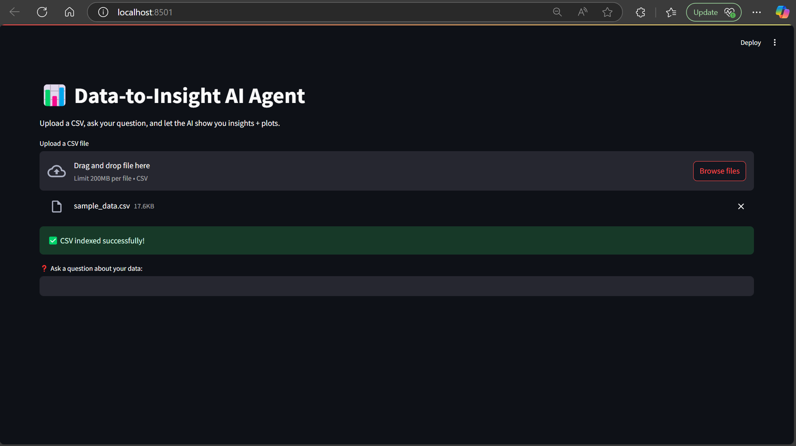

# 📊 Data-to-Insight AI Agent

An LLM agent that answers user questions from CSV files using semantic search, FAISS, and Mistral LLM which returns both natural language insights and personalized plots.

---

## Project Structure

```bash
📂 data-to-insight-agent
├── 📄 app.py                 # Streamlit interface
├── 📄 main.py                # CLI interface
├── 📄 vector_store.py        # FAISS embedding
├── 📄 query_agent.py         # Question answering + plot column logic
├── 📄 plot_generator.py      # Auto plot generation
├── 📄 llm_client.py          # LLM API wrapper
├── 📄 utils.py               # Chunk format
├── 📁 faiss_index/           # Stores FAISS index + metadata
├── 📁 models/                # Local embedding model
├── 📁 plots/                 # Saved plots
├── 📄 .env                   # API key
├── 📄 .gitignore
└── 📄 requirements.txt
```

---

## Key Features

- **CSV Upload**: Accepts specific order data CSV as a knowledge base.
- **Semantic Search**: Uses MiniLM embeddings + FAISS to find relevant rows.
- **LLM Answering**: Uses Mistral-7B  to generate contextual answers.
- **Dynamic Plotting**: Automatically picks the best Y-axis column based on the question.
- **Streamlit UI**: Ask questions, see insights, and view plots in one place.

---

## Requirements

  - `Python 3.10`
  - `streamlit`
  - `faiss-cpu`
  - `sentence-transformers`
  - `pandas`
  - `matplotlib`
  - `requests`
  - `python-dotenv`

---

## Interface



---

## Setup & Installation

1. Clone this repository:
   ```bash
   git clone https://github.com/your-username/data-to-insight-agent.git
   cd data-to-insight-agent
   ```

2. Install the dependencies:
   ```bash
   pip install -r requirements.txt
   ```

3. Download the MiniLM model:
   Place `all-MiniLM-L6-v2` into the `./models/` folder manually or via `sentence-transformers`.

4. Add your Hugging Face API key:
   Create a `.env` file:
   ```env
   HF_TOKEN=your_huggingface_token_here
   ```

5. Run the Streamlit App

   ```bash
   streamlit run app.py
   ```

- Upload a CSV file
- Ask any question like:
  - "Which product had the most orders?"
  - "What was delayed the most?"
- Get:
  - 📈 A custom plot
  - 🧠 A smart answer from the LLM

---

## Technologies Used

- **Mistral-7B**: Pre-trained LLM
- **FAISS**: Vector Database
- **MiniLM (sentence-transformers)**: Vector Embedding
- **Streamlit**: Web UI
- **Matplotlib + Pandas**: Data handling and Visualization

---

## 👨‍💻 Developed By

[github.com/Sanjit1806](https://github.com/Sanjit1806)
